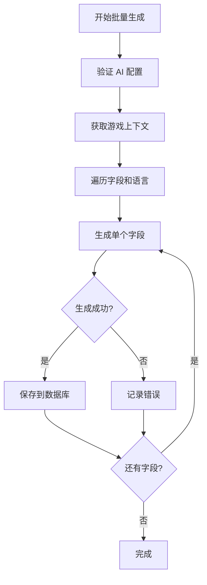

# AI 功能完整指南

本文档整合了 RunGame 平台的 AI 功能实现，包括配置、内容生成、API 集成等。

## 📋 目录

- [AI 配置系统](#ai-配置系统)
- [内容生成功能](#内容生成功能)
- [API 集成](#api-集成)
- [批量生成](#批量生成)
- [质量控制](#质量控制)

## AI 配置系统

### 配置模型

AI 配置存储在数据库中，支持多个 AI 提供商和模型：

```typescript
// 数据库模型
model AiConfig {
  id          String   @id @default(cuid())
  provider    String   // "openai", "anthropic", "openrouter"
  model       String   // 模型名称
  apiKey      String   // 加密存储
  isDefault   Boolean  @default(false)
  isEnabled   Boolean  @default(true)
  config      Json     // 额外配置
  createdAt   DateTime @default(now())
  updatedAt   DateTime @updatedAt
}
```

### 支持的提供商

1. **OpenAI**
   - GPT-4, GPT-4 Turbo, GPT-3.5
   - 配置端点: `https://api.openai.com/v1`

2. **Anthropic**
   - Claude 3 Opus, Sonnet, Haiku
   - 配置端点: `https://api.anthropic.com/v1`

3. **OpenRouter**
   - 统一访问多个模型
   - 配置端点: `https://openrouter.ai/api/v1`

### 配置界面

位置：`/admin/ai-config`

功能：
- ✅ 添加/编辑 AI 配置
- ✅ 设置默认配置
- ✅ 启用/禁用配置
- ✅ API 密钥加密存储
- ✅ 测试 API 连接

## 内容生成功能

### 生成字段

AI 可以生成以下游戏内容：

| 字段 | 类型 | 描述 |
|------|------|------|
| `title` | 文本 | 游戏标题（多语言） |
| `description` | 文本 | 简短描述（160字符） |
| `instructions` | 富文本 | 游戏玩法说明 |
| `seoTitle` | 文本 | SEO 标题（50-60字符） |
| `seoDescription` | 文本 | SEO 描述（150-160字符） |
| `seoKeywords` | 数组 | SEO 关键词（5-10个） |

### 生成模式

#### 1. 单字段生成

点击字段旁的 AI 图标，生成单个字段：

```typescript
// API 调用
POST /api/ai/generate-field
{
  "field": "description",
  "context": {
    "title": "Super Mario",
    "category": "platformer"
  }
}
```

#### 2. 批量生成

同时生成多个字段：

```typescript
POST /api/ai/generate-batch
{
  "fields": ["title", "description", "seoTitle"],
  "context": { ... }
}
```

#### 3. 全量生成

生成所有 AI 字段：

```typescript
POST /api/ai/generate-all
{
  "gameId": "xxx",
  "overwrite": false  // 不覆盖已有内容
}
```

### 提示词模板

AI 提示词在 `lib/ai-prompt-templates.ts` 中定义：

```typescript
export const GAME_DESCRIPTION_PROMPT = `
你是一个专业的游戏文案撰写专家。请为以下游戏生成一个吸引人的描述：

游戏标题: {title}
游戏分类: {category}
游戏标签: {tags}

要求：
- 长度：140-160个字符
- 突出游戏的核心玩法和特色
- 使用吸引人的语言
- 适合目标受众

请直接输出描述内容，不要包含任何解释。
`
```

## API 集成

### AI Provider 抽象层

位置：`lib/ai-providers.ts`

统一的 AI 调用接口：

```typescript
interface AiProvider {
  generateText(prompt: string, options?: GenerateOptions): Promise<string>
  generateJSON(prompt: string, schema: JsonSchema): Promise<any>
  streamText(prompt: string): AsyncIterableIterator<string>
}

// 使用示例
const provider = await getDefaultProvider()
const text = await provider.generateText(prompt, {
  temperature: 0.7,
  maxTokens: 500
})
```

### 错误处理

```typescript
try {
  const result = await generateField(...)
} catch (error) {
  if (error.code === 'RATE_LIMIT') {
    // 速率限制
  } else if (error.code === 'INVALID_API_KEY') {
    // API 密钥无效
  } else if (error.code === 'QUOTA_EXCEEDED') {
    // 配额超限
  }
}
```

### 速率限制

使用 Redis 或内存缓存实现速率限制：

```typescript
// 每分钟最多 10 次调用
const rateLimiter = new RateLimiter({
  points: 10,
  duration: 60
})
```

## 批量生成

### 批量生成对话框

位置：`components/admin/games/BatchGenerateDialog.tsx`

功能：
- ✅ 选择要生成的字段
- ✅ 选择目标语言
- ✅ 设置是否覆盖现有内容
- ✅ 实时显示生成进度
- ✅ 错误处理和重试

### 生成进度跟踪

```typescript
interface GenerateProgress {
  total: number
  completed: number
  failed: number
  current: string
  errors: Array<{
    field: string
    language: string
    error: string
  }>
}
```

### 批量生成流程



## 质量控制

### 字符长度控制

AI 生成的内容会自动检查长度：

| 字段 | 最小长度 | 最大长度 | 建议长度 |
|------|---------|---------|---------|
| `seoTitle` | 40 | 60 | 50-60 |
| `seoDescription` | 140 | 160 | 150-160 |
| `description` | 100 | 200 | 140-160 |

### 内容验证

```typescript
function validateGeneratedContent(field: string, content: string) {
  const rules = FIELD_RULES[field]

  // 检查长度
  if (content.length < rules.minLength) {
    return { valid: false, error: '内容过短' }
  }

  if (content.length > rules.maxLength) {
    return { valid: false, error: '内容过长' }
  }

  // 检查关键词密度
  if (field === 'seoDescription') {
    const keywordDensity = calculateKeywordDensity(content)
    if (keywordDensity < 0.01) {
      return { valid: false, error: '关键词密度过低' }
    }
  }

  return { valid: true }
}
```

### 质量检查迭代

如果生成内容不符合要求，自动重试：

```typescript
async function generateWithRetry(
  prompt: string,
  validator: (content: string) => ValidationResult,
  maxRetries = 3
) {
  for (let i = 0; i < maxRetries; i++) {
    const content = await generateText(prompt)
    const validation = validator(content)

    if (validation.valid) {
      return content
    }

    // 调整提示词并重试
    prompt = adjustPrompt(prompt, validation.error)
  }

  throw new Error('生成失败，已达最大重试次数')
}
```

## 使用示例

### 1. 配置 AI

```bash
# 1. 访问管理后台
http://localhost:3000/admin/ai-config

# 2. 添加 OpenAI 配置
Provider: OpenAI
Model: gpt-4-turbo-preview
API Key: sk-xxx

# 3. 测试连接
点击 "Test Connection" 按钮

# 4. 设为默认
勾选 "Set as Default"
```

### 2. 生成游戏内容

```bash
# 1. 编辑游戏
http://localhost:3000/admin/games/{id}

# 2. 点击字段旁的 AI 图标

# 3. 或使用批量生成
点击 "Batch Generate" 按钮
选择字段和语言
点击 "Generate"
```

### 3. API 调用示例

```typescript
// Server Action
'use server'

import { generateGameContent } from '@/lib/ai-seo-optimizer'

export async function generateContent(gameId: string) {
  const game = await prisma.game.findUnique({
    where: { id: gameId },
    include: {
      category: true,
      tags: true
    }
  })

  const content = await generateGameContent({
    title: game.title,
    category: game.category.slug,
    tags: game.tags.map(t => t.slug)
  })

  await prisma.gameTranslation.updateMany({
    where: { gameId },
    data: {
      seoTitle: content.seoTitle,
      seoDescription: content.seoDescription,
      seoKeywords: content.seoKeywords
    }
  })
}
```

## 故障排查

### 常见问题

**Q: API 调用失败**
```
A: 检查以下内容：
1. API 密钥是否正确
2. 网络连接是否正常
3. 是否超出速率限制
4. 查看错误日志
```

**Q: 生成内容不符合要求**
```
A: 调整提示词模板：
1. 增加更具体的要求
2. 提供更多上下文信息
3. 调整 temperature 参数
```

**Q: 生成速度慢**
```
A: 优化方案：
1. 使用更快的模型（如 GPT-3.5）
2. 减少 maxTokens
3. 使用批量生成而非逐个生成
```

## 最佳实践

1. **提示词设计**
   - 明确具体的要求
   - 提供足够的上下文
   - 使用示例引导输出格式

2. **成本控制**
   - 优先使用较小的模型
   - 合理设置 maxTokens
   - 实现请求缓存

3. **内容质量**
   - 实施多轮验证
   - 人工审核关键内容
   - 持续优化提示词

4. **错误处理**
   - 实现重试机制
   - 记录详细错误日志
   - 提供降级方案

## 相关文件

- [lib/ai-config.ts](../lib/ai-config.ts) - AI 配置管理
- [lib/ai-providers.ts](../lib/ai-providers.ts) - Provider 抽象层
- [lib/ai-prompt-templates.ts](../lib/ai-prompt-templates.ts) - 提示词模板
- [lib/ai-seo-optimizer.ts](../lib/ai-seo-optimizer.ts) - SEO 优化器
- [app/(admin)/admin/ai-config/](../app/(admin)/admin/ai-config/) - 配置界面
- [components/admin/games/BatchGenerateDialog.tsx](../components/admin/games/BatchGenerateDialog.tsx) - 批量生成对话框

---

**最后更新**: 2025-01-20
