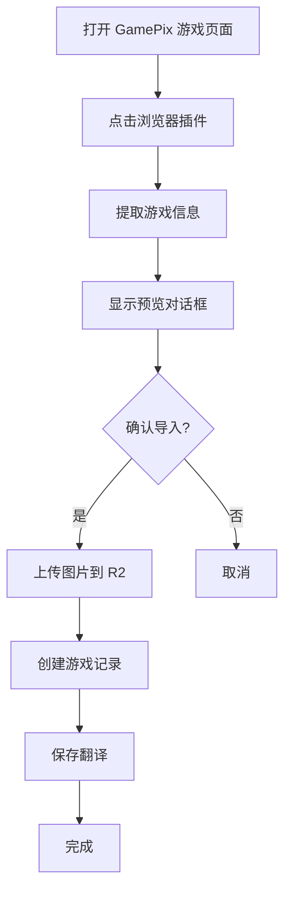

# GamePix 游戏导入完整指南

本文档介绍如何从 GamePix 平台导入游戏到 RunGame，包括浏览器插件、API 集成、字段映射和图片上传。

## 📋 目录

- [导入流程概述](#导入流程概述)
- [浏览器插件使用](#浏览器插件使用)
- [字段映射规则](#字段映射规则)
- [图片上传到 R2](#图片上传到-r2)
- [缓存优化](#缓存优化)
- [故障排查](#故障排查)

## 导入流程概述



## 浏览器插件使用

### 安装插件

1. 打开 Chrome 扩展管理页面：`chrome://extensions/`
2. 启用"开发者模式"
3. 加载解压的扩展文件夹（如果有）

### 使用步骤

1. **访问 GamePix 游戏页面**
   ```
   https://www.gamepix.com/play/{game-slug}
   ```

2. **点击插件图标**
   - 插件会自动提取页面信息
   - 显示游戏预览

3. **确认导入**
   - 检查提取的信息是否正确
   - 修改分类和标签（如需要）
   - 点击"导入"按钮

4. **等待完成**
   - 显示导入进度
   - 成功后可直接跳转到游戏编辑页

### 插件提取的信息

插件会从 GamePix 页面提取以下信息：

| 字段 | 来源 | 示例 |
|------|------|------|
| `title` | 页面标题 | "Super Mario World" |
| `slug` | URL slug | "super-mario-world" |
| `description` | meta description | "A classic platform game..." |
| `thumbnail` | og:image | "https://img.gamepix.com/..." |
| `embedUrl` | iframe src | "https://games.gamepix.com/..." |
| `width` | iframe width | 800 |
| `height` | iframe height | 600 |
| `tags` | 游戏标签 | ["platform", "arcade"] |
| `category` | 游戏分类 | "platformer" |

### 插件配置

插件通过 manifest.json 配置：

```json
{
  "manifest_version": 3,
  "name": "GamePix Importer",
  "version": "1.0.0",
  "permissions": [
    "activeTab",
    "storage"
  ],
  "host_permissions": [
    "https://www.gamepix.com/*",
    "https://img.gamepix.com/*"
  ],
  "action": {
    "default_popup": "popup.html"
  }
}
```

## 字段映射规则

### 基础字段映射

| RunGame 字段 | GamePix 来源 | 处理逻辑 |
|--------------|-------------|----------|
| `title` | `game.title` | 直接映射 |
| `slug` | `game.slug` 或 URL | 自动生成唯一 slug |
| `embedUrl` | `game.embedUrl` | 确保是 HTTPS |
| `thumbnail` | `game.thumbnail` | 上传到 R2，存储 URL |
| `width` | `game.width` | 默认 800 |
| `height` | `game.height` | 默认 600 |

### 多媒体字段映射

| RunGame 字段 | GamePix 来源 | 处理逻辑 |
|--------------|-------------|----------|
| `screenshots` | `game.screenshots[]` | 批量上传到 R2 |
| `videos` | `game.videos[]` | YouTube URL 直接存储 |

### 翻译字段映射

GamePix 主要提供英文内容，其他语言通过 AI 生成：

```typescript
// 英文翻译（直接映射）
translations: {
  en: {
    title: game.title,
    description: game.description,
    instructions: game.instructions || ""
  }
}

// 其他语言（AI 生成）
// 在导入后可使用批量生成功能
```

### 分类映射

GamePix 分类需要映射到 RunGame 分类：

```typescript
const CATEGORY_MAPPING = {
  // GamePix -> RunGame
  "action": "action",
  "adventure": "adventure",
  "puzzle": "puzzle",
  "racing": "racing",
  "sports": "sports",
  "strategy": "strategy",
  "arcade": "arcade",
  "shooting": "shooting",
  // 其他分类...
}
```

如果找不到匹配的分类，使用默认分类"其他"。

### 标签映射

GamePix 标签直接导入，如果标签不存在则自动创建：

```typescript
async function importTags(gamepixTags: string[]) {
  const tags = []

  for (const tagName of gamepixTags) {
    // 查找或创建标签
    let tag = await prisma.tag.findFirst({
      where: {
        translations: {
          some: {
            name: tagName,
            locale: "en"
          }
        }
      }
    })

    if (!tag) {
      // 创建新标签
      tag = await prisma.tag.create({
        data: {
          slug: slugify(tagName),
          isEnabled: true,
          translations: {
            create: {
              locale: "en",
              name: tagName
            }
          }
        }
      })
    }

    tags.push(tag.id)
  }

  return tags
}
```

## 图片上传到 R2

### 上传流程

GamePix 的图片需要上传到 Cloudflare R2 存储：

```typescript
import { uploadImageToR2 } from '@/lib/gamepix-image-upload'

// 1. 下载 GamePix 图片
const response = await fetch(gamepixImageUrl)
const buffer = await response.arrayBuffer()

// 2. 上传到 R2
const r2Url = await uploadImageToR2(
  buffer,
  `games/${gameSlug}/thumbnail.jpg`
)

// 3. 保存 R2 URL
await prisma.game.update({
  where: { id: gameId },
  data: { thumbnail: r2Url }
})
```

### R2 配置

在 `.env` 中配置 R2 凭证：

```env
R2_ACCOUNT_ID=your-account-id
R2_ACCESS_KEY_ID=your-access-key
R2_SECRET_ACCESS_KEY=your-secret-key
R2_BUCKET_NAME=your-bucket-name
R2_PUBLIC_DOMAIN=your-public-domain
```

### 批量上传截图

```typescript
async function uploadScreenshots(
  screenshots: string[],
  gameSlug: string
) {
  const uploadedUrls = []

  for (let i = 0; i < screenshots.length; i++) {
    const url = screenshots[i]
    const response = await fetch(url)
    const buffer = await response.arrayBuffer()

    const r2Url = await uploadImageToR2(
      buffer,
      `games/${gameSlug}/screenshot-${i + 1}.jpg`
    )

    uploadedUrls.push(r2Url)
  }

  return uploadedUrls
}
```

### 图片优化

上传前自动优化图片：

```typescript
import sharp from 'sharp'

async function optimizeImage(buffer: Buffer) {
  return await sharp(buffer)
    .resize(1200, 630, {
      fit: 'cover',
      position: 'center'
    })
    .jpeg({
      quality: 85,
      progressive: true
    })
    .toBuffer()
}
```

## 缓存优化

### 导入缓存

为避免重复导入，使用缓存记录：

```typescript
model GameImportCache {
  id              String   @id @default(cuid())
  source          String   // "gamepix"
  sourceId        String   // GamePix 游戏 ID
  gameId          String?  // RunGame 游戏 ID
  sourceData      Json     // 原始数据
  importedAt      DateTime @default(now())

  @@unique([source, sourceId])
  @@index([source])
}
```

### 检查是否已导入

```typescript
async function checkIfImported(
  source: string,
  sourceId: string
) {
  const cache = await prisma.gameImportCache.findUnique({
    where: {
      source_sourceId: {
        source,
        sourceId
      }
    }
  })

  return cache?.gameId
}
```

### 更新缓存

```typescript
async function updateImportCache(
  source: string,
  sourceId: string,
  gameId: string,
  sourceData: any
) {
  await prisma.gameImportCache.upsert({
    where: {
      source_sourceId: {
        source,
        sourceId
      }
    },
    create: {
      source,
      sourceId,
      gameId,
      sourceData
    },
    update: {
      gameId,
      sourceData,
      importedAt: new Date()
    }
  })
}
```

## 故障排查

### 常见问题

#### 1. 插件无法提取信息

**原因**：
- GamePix 页面结构变化
- 网络请求被阻止
- 插件权限不足

**解决方案**：
```javascript
// 检查页面结构
console.log('检查页面元素...')
const titleElement = document.querySelector('.game-title')
if (!titleElement) {
  console.error('无法找到游戏标题元素')
}

// 检查权限
chrome.permissions.contains({
  origins: ['https://www.gamepix.com/*']
}, (result) => {
  if (!result) {
    console.error('缺少必要权限')
  }
})
```

#### 2. 图片上传失败

**原因**：
- R2 配置错误
- 图片 URL 无法访问
- 文件大小超限

**解决方案**：
```typescript
try {
  const r2Url = await uploadImageToR2(buffer, path)
} catch (error) {
  if (error.code === 'EntityTooLarge') {
    // 压缩图片
    buffer = await optimizeImage(buffer)
    // 重试
  } else if (error.code === 'NoSuchBucket') {
    // 检查 R2 配置
    console.error('R2 bucket 不存在')
  }
}
```

#### 3. 分类映射失败

**原因**：
- GamePix 分类不在映射表中
- 分类名称拼写错误

**解决方案**：
```typescript
function mapCategory(gamepixCategory: string) {
  const mapped = CATEGORY_MAPPING[gamepixCategory.toLowerCase()]

  if (!mapped) {
    console.warn(`未找到分类映射: ${gamepixCategory}`)
    return 'other' // 使用默认分类
  }

  return mapped
}
```

#### 4. 导入重复游戏

**原因**：
- 缓存未生效
- slug 冲突

**解决方案**：
```typescript
// 检查 slug 是否已存在
let slug = baseSlug
let counter = 1

while (await prisma.game.findUnique({ where: { slug } })) {
  slug = `${baseSlug}-${counter}`
  counter++
}
```

### 调试工具

```typescript
// 启用详细日志
export const DEBUG = process.env.NODE_ENV === 'development'

export function debugLog(message: string, data?: any) {
  if (DEBUG) {
    console.log(`[GamePix Import] ${message}`, data || '')
  }
}

// 使用
debugLog('开始导入游戏', { slug: gameSlug })
```

## 最佳实践

1. **导入前检查**
   - 验证游戏是否已存在
   - 检查分类和标签是否有效
   - 确认图片 URL 可访问

2. **批量导入**
   - 使用队列系统避免并发过多
   - 实现进度跟踪
   - 错误日志记录

3. **数据验证**
   - 验证必填字段
   - 检查 URL 格式
   - 限制字符串长度

4. **性能优化**
   - 图片上传使用并发
   - 缓存重复查询
   - 使用事务处理

## 相关文件

- [lib/gamepix-importer.ts](../lib/gamepix-importer.ts) - 导入逻辑
- [lib/gamepix-image-upload.ts](../lib/gamepix-image-upload.ts) - 图片上传
- [components/admin/games/GamePixBrowser.tsx](../components/admin/games/GamePixBrowser.tsx) - 浏览器组件
- [app/api/gamepix/](../app/api/gamepix/) - API 路由

---

**最后更新**: 2025-01-20
